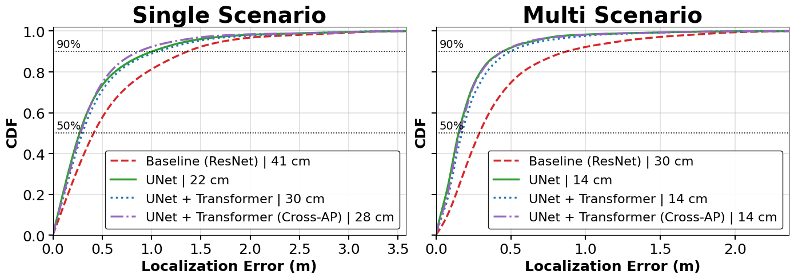

# DLoc Re-implementation: Deep Learning for WiFi-Based Indoor Localization

> Re-implementation project for CS4782 (Deep Learning), Cornell University, May 2026.
> Anusha Muralidharan · Evan Navar Root · Erdis Brahimi

---

## 1. Introduction

This repository re-implements **DLoc**, a deep learning framework for WiFi-based indoor localization that frames positioning as an **image-to-image translation problem**. Raw channel state information (CSI) matrices are converted to 2D spatial heatmaps via 2D-FFT and polar-to-Cartesian transform; a single encoder with two parallel decoders predicts a Gaussian location heatmap and ToF-offset-corrected access point(AP) heatmaps, achieving 64 cm median error in a complex non line of sight (NLOS) environment.

---

## 2. Chosen Result

We target **Figure 10b** of the original paper which is the localization error CDF in the complex 1500 sq. ft. indoor environment with NLOS and multipath and **Figure 11b** (consistency decoder ablation).

| Original result (Fig. 10b) | Our reproduction |
|---|---|
| DLoc: 64 cm median, 160 cm P90 | Baseline: 41 cm median, 143 cm P90 (single scenario) |

We extend Figure 11b's binary ablation to a **consistency weight sweep** (λc ∈ {0.0, 0.01, 0.1, 0.5}), showing the decoder is essential (λc=0 → 721 cm) but performance stabilises above λc≈0.01.

---

## 3. GitHub Contents

```
├── code/
│   ├── models/
│   │   ├── baseline.py                  # ResNet encoder-decoder (paper reimplementation)
│   │   ├── unet.py                      # UNet with skip connections
│   │   ├── unet_transformer.py          # SE-UNet with Transformer bottleneck
│   │   └── unet_crossap_transformer.py  # Cross-AP Attention + Transformer
│   ├── dataset.py                       # NPZ loader, train/test split
│   ├── losses.py                        # Weighted MSE + L1 sparsity + consistency loss
│   ├── evaluate.py                      # Error metric, CDF plotting
│   └── train.py                         # Training loop, scheduler, checkpoint saving
│   ├── preprocessing/
│   │   ├── mat_to_npz.py                # Converts raw .mat files to .npz chunks
│   │   └── resize_grid.py               # Resizes scenarios to common grid size
│
├── results/
│   ├── baseline_s1/
│   │   ├── baseline_s1_final_errors.npy
│   │   └── baseline_s1_training_metrics.csv
│   ├── baseline_s2/
│   ├── unet_s1/
│   ├── unet_s2/
│   ├── transformer_s1/
│   ├── transformer_s2/
│   ├── crossap_s1/
│   └── crossap_s2/
│
├── poster/
├── report/
├── requirements.txt
└── README.md
```
Each results subfolder contains:
- `<model>_<scenario>_final_errors.npy`
- `<model>_<scenario>_training_metrics.csv`

`s1` = single scenario (~11k samples), `s2` = mixed 3-scenario (~9k samples).

---

## 4. Re-implementation Details

**Models:**

| Model | Key idea |
|---|---|
| `baseline.py` | ResNet encoder + dual decoder (location + consistency), InstanceNorm throughout |
| `unet.py` | Adds skip connections at 4 encoder scales (bilinear upsample + concat + ResDoubleConv), 3× bottleneck at 1024ch |
| `unet_transformer.py` | SE channel attention at every ResDoubleConv block + TransformerBottleneck (8 heads) |
| `unet_crossap_transformer.py` | CrossAPAttention after encoder stages 1–3 (AP channel groups as tokens, learnable gate) + TransformerBottleneck with 2D sinusoidal positional encoding |

**Dataset:** [WILD dataset](https://wcsng.ucsd.edu/wild/), 1500 sq.ft complex indoor room pre-processed features (`features_w_offset`, `features_wo_offset`, `labels_gaussian_2d`).  
Raw .mat files (11–29 GB) converted to float16 `.npz` chunks of 1000 samples (~5 GB/scenario) for Colab compatibility.

**Two training regimes:**
- `s1` — single scenario, ~11k samples
- `s2` — mixed 3 scenarios, ~9k samples (3k each)

**Loss:**
The baseline model uses the paper-style weighted L1 location loss + L1 consistency loss.  
The UNet-based models use a modified loss:

```text
L = (5L_GT + 0.1)·MSE(ŷ, L_GT) + λs‖ŷ‖₁ + λc·MSE(ĉ, B)
```
**Training:** Adam (lr=1e-4, wd=1e-5), StepLR (γ=0.5, step 5), 10 epochs, batch 16.  
**Metric:** Median and P90 localization error (cm) on 80/20 train/test split.

**Key challenges:**
- Limited GPU memory restricts batch size for transformer based models
- Scenarios have different spatial extents — bilinear downsampling to common grid loses detail in larger grids
- Transformer was unstable during early epochs showing very high error before convergence (epoch 1: 917 cm median, recovers by epoch 4)
- Full dataset ( ~80-100GB) could not be used. Experiments performed on reduced subsets. So limited generalization. 

---

## 5. Reproduction Steps

### Install dependencies
```bash
pip install -r requirements.txt
```
### Download and prepare data
Download the WILD dataset from [https://github.com/ucsdwcsng/DLoc_pt_code/blob/main/wild.md#downloads]  
and place `.mat` files in `data/raw/`. The dataset files are 11–29 GB each;  We used the following subsets:

- `dataset_jacobs_July28.mat`
- `dataset_jacobs_July28_2.mat`
- `dataset_aug16_4_ref.mat` (complex environment with reflector)

### Preprocessing pipeline

Raw `.mat` files are converted into compressed `.npz` chunks (~1000 samples per file) using:

```bash
python code/preprocessing/mat_to_npz.py --input data/raw/<file>.mat --output data/<scenario_name>
```
To standardize spatial resolution across scenarios, heatmaps are resized to a common grid:

```bash
python code/preprocessing/resize_grid.py --input data/<scenario_name> --output data/<scenario_name>_resized
```
Preprocessed `.npz` data can be downloaded here (restricted to Cornell access only):[https://drive.google.com/drive/folders/1Yu8NlegvyCDvzDedaokEcslB0ep9DOg0?usp=sharing].

### Dataset Construction

Two datasets are used:

- **S1 (single scenario):**  
  ~11k samples from a single environment (`dataset_jacobs_July28`)

- **S2 (complex multi-scenario):**  
  ~9k samples constructed by combining subsets from multiple environments:
  - Reflector-based complex environment (Aug16)
  - Additional indoor layouts (`July28`, `July28_2`)

Selected subsets from each dataset were resized and merged to simulate a diverse **NLOS/multipath environment**.


### Run training on models
```bash
cd code

python train.py --model unet --data_path ../data/scenario_1
python train.py --model baseline --data_path ../data/scenario_1
python train.py --model unet_transformer --data_path ../data/scenario_1
python train.py --model crossap_transformer --data_path ../data/scenario_1

```

## Running on Google Colab

```python
from google.colab import drive
drive.mount('/content/drive')

%cd /content/drive/MyDrive/CS4782_project

!pip install -r requirements.txt

# UNet
!python code/train.py --model unet --data_path data/scenario_1 --epochs 10 --batch_size 32 --save_dir results/unet_s1

```
### Try other models

```python
# Baseline
!python code/train.py --model baseline --data_path data/scenario_1 --save_dir results/baseline_s1

# UNet + Transformer (use smaller batch size)
!python code/train.py --model unet_transformer --data_path data/scenario_1 --batch_size 8 --save_dir results/transformer_s1
```

**Compute:** GPU required. ~250 s/epoch on a Colab T4 at batch size 16 for ~11k samples.  
Checkpoints and metrics are saved automatically to `--save_dir` after each epoch.

---

## 6. Results / Insights

| Model | S1 Median / P90 | S2 Median / P90 |
|---|---|---|
| Baseline (DLoc) | 41 cm / 143 cm | 30 cm / 94 cm |
| UNet | **22 cm / 106 cm** | **14 cm / 51 cm** |
| SE-UNet + Transformer | 30 cm / 110 cm | 14 cm / 51 cm |
| Cross-AP + Transformer *(proposed)* | **28 cm** / — | **14 cm** / — |
| DLoc paper (Fig. 10b) | 64 cm / 160 cm | — |



**Key insights:**
- **UNet skip connections** provide the largest single improvement : 46% median reduction over baseline on S1, most notable at P90 (hard NLOS cases)
- **Cross-AP attention** outperforms SE UNet (28 cm vs 30 cm on S1), confirming that explicit inter-AP reasoning at the encoder adds signal beyond channel-wise recalibration
- **Data diversity dominates architecture**: all UNet family models converge to 14 cm on S2 regardless of complexity, while the baseline stalls at 30 cm, the only model that does not close the gap with diverse data
- **14 cm floor = grid resolution limit**: one diagonal pixel on the output grid. A finer grid or continuous regression head would be needed to go lower
- **Consistency loss is binary-critical**: λc=0 causes complete failure (721 cm); performance is insensitive to the exact value above λc≈0.01

---

## 7. Conclusion

Skip connections (UNet) provide the most reliable architectural improvement for single-scenario localization. The proposed Cross-AP Attention module further improves on the SE UNet baseline by explicitly modelling inter AP relationships at the encoder, reducing single-scenario median error to 28 cm. With diverse training data all architectures saturate the grid resolution floor, showing that data diversity and output resolution are the primary bottlenecks for further progress and not model capacity.

---

## 8. References

- Ayyalasomayajula, Roshan, et al. "Deep learning based wireless localization for indoor navigation." Proceedings of the 26th Annual International Conference on Mobile Computing and Networking. 2020. https://doi.org/10.1145/3372224.3380894
- WILD Dataset: https://github.com/ucsdwcsng/DLoc_pt_code/blob/main/wild.md#downloads 
- Ronneberger, Olaf, Philipp Fischer, and Thomas Brox. "U-net: Convolutional networks for biomedical image segmentation." International Conference on Medical image computing and computer-assisted intervention. Cham: Springer international publishing, 2015.
- Hu, Jie, Li Shen, and Gang Sun. "Squeeze-and-excitation networks." Proceedings of the IEEE conference on computer vision and pattern recognition. 2018.
- Vaswani, Ashish, et al. "Attention is all you need." Advances in neural information processing systems 30 (2017).

---

## 9. Acknowledgements

This project was completed as part of **CS4782: Intro to Deep Learning** at Cornell University (Spring 2026).  
We thank the course staff for guidance throughout the project and the UCSD Wireless Communications Sensing and Networking (WCSNG) group for making the WILD dataset publicly available.